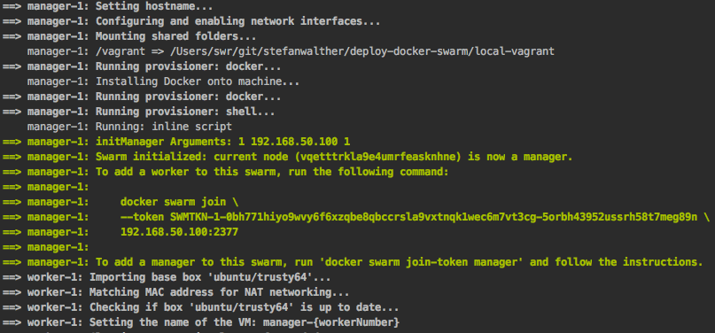

# Deploy a swarm cluster on your local machine (using Vagrant)

## Summary

The following tasks will be performed:

- Create a few machines on your local VirtualBox
- Init a Docker swarm (manager + worker nodes)
- Deploy a Docker stack (Docker compose v3; swarm mode)


## Prerequisites

- [VirtualBox](https://www.virtualbox.org/)
- [Docker for Mac](https://docs.docker.com/docker-for-mac/) / [Docker for Windows](https://docs.docker.com/docker-for-windows/)
- [Vagrant](https://www.vagrantup.com/)

## Run

If you have already installed all of the pre-requisites, then you are ready to go!

Run with default options (3 managers, 2 workers).

```sh
$ vagrant up
```

This will 

- provision 3 managers, 
- 2 workers and 
- deploy, initialize a docker swarm and 
- deploy the services as defined in `./../lib/docker-stack.yml`.

## Configuration

Open the `config.yml` file to change the configuration options:

- `NUM_OF_MANAGERS` - Number of managers to create (defaults to `3`).
- `NUM_OF_WORKERS` - Number of workers to create (defaults to `2`).
- `MEMORY` - Allocated memory for each of the machines (defaults to `1024`)
- `NUM_CPUS` - Allocated number of CPUs for each of the machines (defaults to `2`)

Save the file and run

```sh
$ vagrant up
```

## Play with it

Open the UIs:

- Swarm visualizer: [http://192.168.50.100:8080](http://192.168.50.100:8080) 
- Voting app: [http://192.168.50.100:5000](http://192.168.50.100:5000)
- Voting results: [http://192.168.50.100:5001](http://192.168.50.100:5001)
- [Portainer](http://portainer.io/) : [http://192.168.50.100:9000](http://192.168.50.100:9000)

ssh into a machine:
```sh
$ vagrant ssh <machine-name>
```

[Play with it](./docs/play-with-it.md)

Destroy machine + resources created:
```sh
$ sh destroy.sh
```
Stops the running machine Vagrant is managing and destroys all resources that were created during the machine creation process
[Vagrant => destroy](https://www.vagrantup.com/docs/cli/destroy.html)

## Tips & Tricks

If you want to see how long it takes to set up your environment, prepend the `vagrant up` with `time`:

```sh
$ time vagrant up
```

### Troubleshooting & Debugging

See [Debugging](https://www.vagrantup.com/docs/other/debugging.html) in the official Vagrant documentation.

```sh
$ vagrant up --debug
```

or 

```shvagra
$ vagrant up --debug &> vagrant.log

# or on Windows
# $ vagrant up --debug > vagrant.log 2>&1
```


## Screenshots

### Creation Process




## Todos

- [ ] Security setup, TSL
- [x] Automatically install the vagrant plugins without `vagrant-plugins.sh`
- [ ] Check which OS to use
- [ ] Test Windows & MacOs
- [ ] Make sure that all configurations are used
- [ ] Investigate how to run some test-scripts at the end
- [ ] Enable experimental docker service logs (see https://sreeninet.wordpress.com/2017/01/27/docker-1-13-experimental-features/)
- [ ] Potential improvement to use a YML to share the configuration: http://blog.scottlowe.org/2016/01/14/improved-way-yaml-vagrant/
- [ ] Make IP-addresses dynamic
- [x] Use the same docker-stack.yml file as in the other examples
- [ ] Echo a nice summary of what has been set-up
- [ ] Would be nice to fully test the entire script
- [ ] Take newest ubuntu release or think of a thinner OS
- [ ] Expose a configuration option to define the docker-stack.yml file

## Reference links

- [Docker swarm mode sample app](https://docs.docker.com/engine/getstarted-voting-app/) 
- [Code sample docker swarm mode](https://github.com/eyal-lupu/vagrant-docker-swarm-mode/blob/master/Vagrantfile)
- https://github.com/docker/docker/issues/31516
- https://technology.amis.nl/2015/08/22/first-steps-with-provisioning-of-docker-containers-using-vagrant-as-provider/ and https://www.simonholywell.com/post/2016/02/intelligent-vagrant-and-ansible-files/